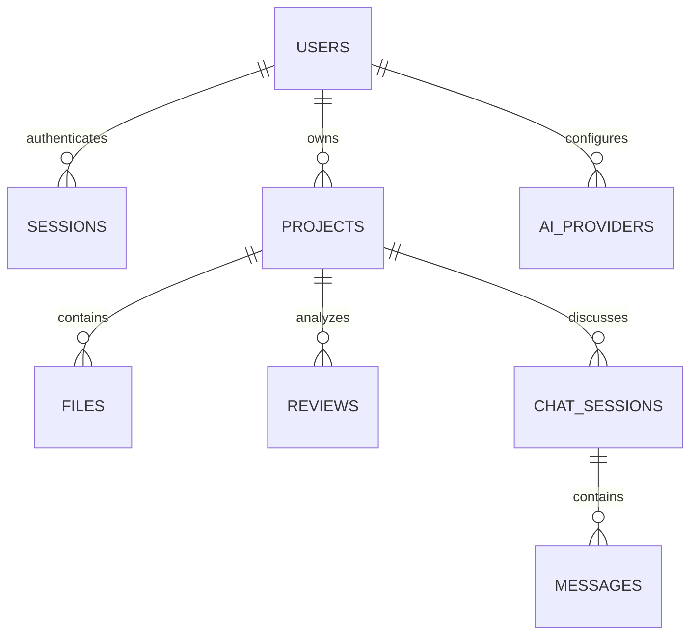

# Architecture and engineering decisions

## Scope

CodeAtlas deliberately implements the eight core assessment features plus documentation generation and architecture analysis. FastAPI is one of the assessment's permitted backend choices. PostgreSQL meets the preferred database option. The design favors a small, understandable application with durable user data and explicit failure behavior.

## Frontend

Next.js App Router pages are organized into public login/register routes and a protected workspace route group. A Next.js proxy redirects requests without the session cookie; the workspace then verifies `/auth/me` before rendering private content. The backend validates every request, so merely supplying a cookie cannot grant access.

TypeScript models describe API payloads. A centralized request helper adds credentials and the CSRF protection header, converts backend validation failures into readable errors, and redirects expired authenticated requests to login. All browser API traffic uses the Next.js `/api` rewrite; API keys never enter browser storage or public environment variables.

The workspace has project cards, statistics, provider management, paginated history and a project workbench. Reusable components implement the file tree, code preview, review output, Markdown, form errors and focus-trapped dialogs. Prism highlights escaped source text; React Markdown renders AI artifacts without enabling raw HTML. Tailwind 4 provides the stylesheet pipeline, with custom design tokens and responsive component styles in `globals.css`.

The project workbench independently manages file selection and file preview: selecting a file for a review does not change source contents, and opening it does not select it for review. Zero selections means the whole project; explicit selections support one or several files. Request sequence IDs prevent slower source requests from overwriting a newer preview. History searches debounce and cancel stale UI updates. The AI and upload controls show pending states and disable duplicate submission.

## Backend

FastAPI exposes OpenAPI documentation at `/docs` and routers grouped by responsibility:

| Module | Responsibility |
| --- | --- |
| `routers/auth.py` | Registration, login, logout, session issuance |
| `routers/projects.py` | Owned project operations and atomic upload/upsert |
| `routers/providers.py` | Encrypted user-owned provider configuration and connection checks |
| `routers/reviews.py` | File selection, persisted analysis and searchable history |
| `routers/chat.py` | Conversation persistence and source-grounded questions |
| `services/uploads.py` | Text-file recognition, ZIP/path validation and limits |
| `services/ai.py` | Endpoint validation, prompts, provider transport, response schema and lexical retrieval |
| `security.py` | Argon2 hashing, session validation, ownership checks and Fernet encryption |
| `db.py` / `models.py` | SQLAlchemy session lifecycle and relational schema |

Pydantic validates inputs and review results. PostgreSQL sessions are request-scoped and close/rollback on failure. Uploads acquire a project row lock so simultaneous uploads cannot bypass per-project quotas. Validation happens before writes; a failed multi-file upload is rolled back as a unit. The versioned Alembic migration controls schema installation independently of API startup.

Blocking database work uses synchronous SQLAlchemy for simplicity; async AI transport uses HTTPX. For a larger workload, switch the async request paths to AsyncSession or push model work into a queue. Network requests have bounded timeouts and do not follow redirects. Provider HTTP errors are sanitized to avoid disclosing upstream responses or credentials.

## Database design

All resource IDs except session hashes are UUID strings. Time columns use timezone-aware timestamps. Foreign-key deletion cascades remove project source/reviews/conversations or user-owned records. File paths are unique within a project; email addresses are normalized and unique. Parent foreign keys and review timestamps are indexed.

| Table | Key stored data |
| --- | --- |
| users | Name, normalized email, Argon2 password hash, creation date |
| sessions | SHA-256 hash of an opaque random cookie token, user FK, expiration |
| projects | Owner FK, name, description, creation date |
| files | Project FK, relative path, UTF-8 content, language, byte size |
| ai_providers | Owner FK, display name, base URL, model, encrypted key |
| reviews | Project FK, mode, provider/model snapshot, selected paths, structured JSON result, timestamp |
| chat_sessions | Project FK, timestamp |
| messages | Session FK, role, text, timestamp |

Storing text directly in PostgreSQL avoids unmanaged upload directories and orphan cleanup. Limits bound storage and context use. Large-scale code storage would move into object storage with database metadata. JSON results preserve structured severities, recommendations and generated Markdown without a second schema for each review mode. Provider name/model are copied into the review, so changing or removing provider configuration does not erase historical analysis.

Reviews keep selected paths and results, not immutable copies of complete source. Re-uploading a file can make old source references stale; timestamps distinguish analysis versions. Production audit tooling should add source digests or immutable upload snapshots.

## AI integration flow

1. Authenticate the account and check ownership of both project and provider.
2. Load project files; validate every explicit selection against the project.
3. Build deterministic context with exact paths, syntax labels and numbered lines.
4. Reject oversized review context rather than silently claiming full coverage.
5. Add the selected review template and JSON schema to the system prompt. Treat code as untrusted data, not instructions.
6. Decrypt the provider key on the backend and POST to the configured `/chat/completions` endpoint.
7. Prefer JSON mode; if a compatible endpoint rejects `response_format`, retry without it. Validate returned JSON regardless.
8. Validate severity values, required fields, allowed file paths, line bounds and required bonus artifacts.
9. Persist only a validated successful result, along with the selected paths and provider/model snapshot.
10. Return the structured result to the UI; allow severity filtering, source navigation and Markdown export.

Chat scores files using question terms, weights path matches more heavily and includes at most 12 files. The prompt includes code and up to 12 recent conversation messages. Long chat context is capped with an explicit truncation marker. After a successful response, both the question and answer are committed together. Failed requests do not create misleading assistant messages.

## Authentication and security boundaries

Passwords use Argon2 through pwdlib. Session cookies are opaque, HttpOnly and SameSite=Lax; only their hashes are stored. Logout deletes the database session, so replaying the previous token fails. Expired sessions are rejected and cleaned up on later sign-in. Unknown-user login executes a dummy password verification to reduce timing differences.

Every private endpoint verifies user ownership. Unauthorized resource IDs return 404. Modifying requests require a custom `X-Requested-With: CodeAtlas` header and, when present, the exact configured origin. This combines same-origin browser requests with CORS preflight protection; the header is not a secret. Cross-origin mutation attempts are rejected.

Manually saved provider keys are encrypted with Fernet and never returned in API responses; the UI receives only `has_api_key`. Keys are not logged. An optional environment-managed provider reads a SecretStr credential only on the backend and requires an exact match of both registered owner ID and email. A reserved `environment` identifier cannot bypass ownership checks or be edited/deleted through the UI. This prevents another user from gaining access by registering a matching email in a different database. Environment secrets are not persisted as a second provider record, and validation errors hide raw input values. Unit tests and browser-test servers explicitly clear environment keys. Private and loopback endpoints are permitted when local inference is enabled. Link-local metadata endpoints, embedded URL credentials, fragments, queries, unspecified/multicast destinations and remote plain HTTP are blocked. DNS validation is not a replacement for outbound firewalling: public deployments should disable local access and apply host/egress restrictions to address DNS rebinding and internal-network exposure.

Uploads never execute or extract files onto the server filesystem. Path traversal, symlinks and oversized archives are rejected; binaries and likely secret/config files are skipped. Source is private to its account but may still contain credentials; users should inspect it before sending it to a provider.

## Tradeoffs and next engineering steps

- Synchronous database operations and request/response reviews keep the internship scope approachable. A distributed queue, streamed progress and async database access suit larger workloads.
- Lexical retrieval is transparent and sufficient for the requested simple context retrieval. It lacks semantic search and sophisticated chunking.
- Process-local auth rate limiting is appropriate for a single API process; shared gateway/Redis quotas are needed for multiple replicas and per-user AI budgets.
- Character-based context budgets are model-independent and conservative. Token-aware budgets and model capability settings would improve provider compatibility.
- The app has registration/login/logout but intentionally omits email verification, password reset, organizations and OAuth, none of which the assessment requires.
- The Docker configuration runs in local development mode and needs explicit HTTPS/gateway/security configuration for public deployment.
- Deterministic fixtures test API contracts and browser integration, not AI accuracy. An opt-in live suite separately verifies real Groq transport and feature behavior using only bundled samples; it does not establish comprehensive model accuracy.
