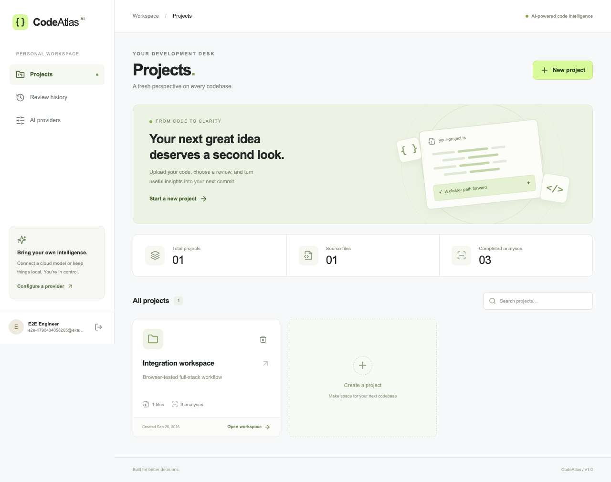
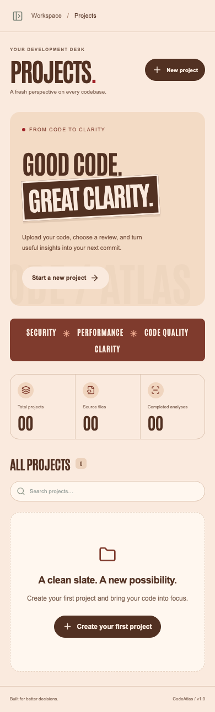

# Verification report

Verified locally on **26 September 2026** with Node.js 22.22.2, Python 3.12, PostgreSQL 16.15 and Chromium through Playwright.

## Results

| Check | Observed outcome |
| --- | --- |
| Backend integration/unit tests | **36 passed** against real PostgreSQL |
| Ruff lint | Passed |
| Ruff formatting check | Passed |
| Frontend ESLint | Passed without warnings |
| TypeScript strict typecheck | Passed |
| Next.js production build | Passed; all pages and the route proxy compiled |
| Live Groq feature verification | Passed with `openai/gpt-oss-120b`: five modes, grounded chat, persistence, history and owner isolation; one bounded architecture retry in the final run |
| Browser end-to-end suite | **4 passed**, including the comprehensive desktop workflow, responsive workbench and motion/preference/navigation checks |
| PostgreSQL migration round trip | Upgrade → downgrade → upgrade passed on a dedicated scratch database |
| Docker Compose configuration | `docker compose config --quiet` passed after generating local secrets |
| Frontend dependency audit | npm reported **0 vulnerabilities** at installation |
| Running application | Production frontend proxy verified owner login, private Groq visibility, live connection, protected page and logout; backend health returned `database: connected` |
| Visual review | Reference-inspired desktop login/dashboard/workbench and 390px mobile dashboard/workbench reviewed; responsive and reduced-motion checks passed |

## Backend coverage

- Registration validation, email normalization, duplicate accounts and invalid passwords.
- HttpOnly/SameSite cookies, current-account endpoint, session expiry and logout replay rejection.
- CSRF header, origin rejection and authentication request limiting.
- Project creation/list/detail, text-source preview, replacement by path and deletion cascade.
- Cross-user project/file/provider/review/chat access denied; history lists only owned projects.
- ZIP folder hierarchy, secret-file/generated-directory exclusion, corrupt archive, binary and oversized-file rejection.
- Absolute/traversal/Windows path rejection and request-body limits before multipart parsing.
- Provider key encryption, secret-free response serialization, edits, connection test and deletion.
- Environment-managed provider restricted by both registered account ID and email; immutable through the provider UI; SecretStr and validation-error redaction.
- Unsafe provider destinations and URL credential/query rejection.
- All five analysis modes, structured severity output, exact path/line references and searchable stored history.
- One-file, multiple-file and whole-project selection; invalid selections rejected.
- Malformed AI output, invented source references, credential failure and context-overflow errors do not save successful reviews.
- OpenAI-compatible JSON-mode fallback for servers rejecting `response_format`.
- Lexical retrieval, chat source context, recent message context, persistence and deletion cascade.

## Browser coverage

1. **Protected navigation:** unauthenticated project access redirects to the login screen.
2. **Full desktop lifecycle:** registration → project creation → file upload → preview/highlighting → provider creation/connection check → selected-file security review → source-line navigation → Markdown download → documentation generation → architecture analysis → chat → reload/persistence → history search/details → project/provider deletion → logout → login.
3. **Mobile:** 390 × 844 viewport; registration, empty dashboard, side navigation, provider empty state and no document-level horizontal overflow. The desktop lifecycle also checks and captures the populated review workbench at this width.
4. **Studio motion:** hydrated and completed ribbon reveals; runtime reduced-motion switching; 360, 768 and 1440px responsive layouts; navigation across projects/history/providers; no browser runtime errors or missing GSAP targets.

Browser tests use a separate PostgreSQL database ending in `_e2e`. A local OpenAI-compatible fixture server exercises real HTTP transport, context and structured responses. Its provider name and every response clearly say **TEST FIXTURE / not AI**. Test projects/providers are deleted through the workflow; test accounts remain only in the dedicated test database. No test account/provider was created in the normal application database.

## Corrections during verification

- IPv6 `::1` was initially rejected by the reserved-address check. Local loopback is now accepted when local AI support is enabled, preserving LM Studio/Ollama use through localhost.
- The frontend dashboard screenshot now waits for its project data rather than recording an intermediate loading state.
- Source-reference navigation scrolls the source pane rather than deliberately scrolling the entire workspace.
- Multipart uploads are bounded before parsing, including requests without a declared content length, in addition to source/archive/project quotas.
- Final readability adjustments increased source and analysis-control text sizes; responsive screenshots were reviewed after the changes.
- The reference-inspired interface adds scoped GSAP motion and self-hosted Antonio typography. Empty animation targets are guarded, route changes revert animation contexts, and screenshots wait for hydration and finished reveals rather than recording an intermediate animation frame.

The final handover check also found generated route-type collisions when browser tests and the normal TypeScript check ran concurrently. The browser server now uses a dedicated `tsconfig.e2e.json`; each configuration excludes the other generated build directory. Production type generation and browser tests were rerun after this correction.

## Live provider verification

The supplied credential authenticated successfully against Groq's model-list endpoint. Live calls then exercised `openai/gpt-oss-120b` through the real application routes and real PostgreSQL in a dedicated `_live_e2e` database:

- Owner-scoped environment provider visibility and connection check.
- Single-file security review; multiple-file performance review; full-project code-quality review.
- Generated documentation and architecture artifacts, validated against the application's JSON schema and source references.
- Code-grounded chat with a `src/auth.py` reference; persisted messages and searchable review history.
- Logout and an unrelated account unable to see or invoke the environment-managed credential.

Only bundled sample files were supplied as AI context. No environment files or actual credentials were uploaded as code. The private key and sanitized local execution report are excluded from Git and the handover ZIP.

An initial chat request failed with HTTP 502; a subsequent real chat request passed. The final complete live run passed, with one architecture request succeeding after a single 30-second retry. The opt-in verification script reports these attempts rather than presenting them as first-attempt successes. Normal app requests surface provider errors instead of manufacturing output.

A local owner account was configured, with login details stored only in ignored `backend/.local/owner-login.json`. The managed key is visible only to the exact account ID and email configured in ignored `backend/.env`; no login details or account identifiers are included in this report.

## Limits of this verification

- **Groq was tested live** with a privately configured credential and the available `openai/gpt-oss-120b` model. Other cloud providers and running LM Studio/Ollama models were not tested. These sample-based checks verify integration and observable feature behavior; they do not establish comprehensive model accuracy or latency guarantees.
- **Docker Engine was not running.** Compose configuration was validated; container builds/startup were not executed. The application itself ran directly on the host with real PostgreSQL.
- Automated browser coverage uses Chromium; other browser engines, broad accessibility audits, load tests and public deployment were not performed.
- The backend test runner emits a Starlette deprecation warning for its HTTPX TestClient adapter; assertions pass. It is a dependency warning, not an application failure.
- AI findings remain advisory. Character limits, lexical retrieval, process-local rate limiting, mutable file history and public deployment hardening are documented in `ARCHITECTURE.md`.

## Screenshots

The dashboard images below were captured from the browser test environment. Counts and accounts are test data, not preloaded application/demo data.

